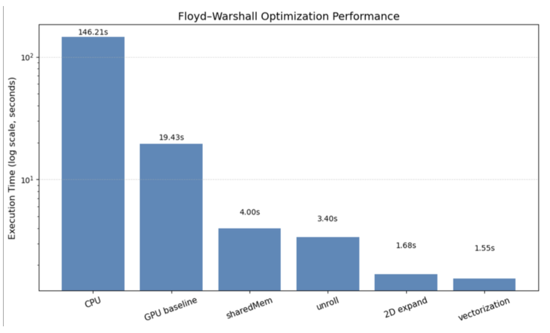
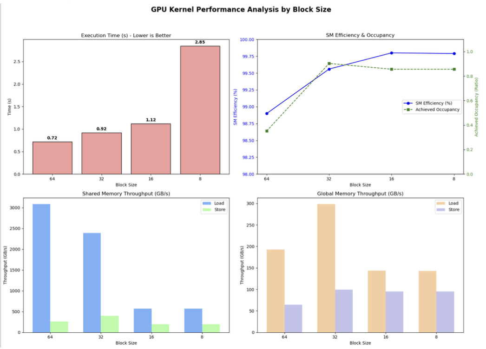

# Floyd-Warshall CUDA Optimization Report

* **Author**: Tao Wei-Lun
* **Subject**: All-Pairs Shortest Path

## 1. Core Architecture
This project implements a **Blocked Floyd-Warshall** algorithm, progressing from a multi-threaded CPU baseline to a highly optimized Multi-GPU solution.

### Critical Optimizations
The GPU implementation achieves performance through a strictly hierarchical memory strategy:

1.  **Global Memory**: Accessed strictly via **`int4` vectorization**. This coalesces 4 integer loads into a single 128-bit transaction, maximizing memory bandwidth.
2.  **Shared Memory**: A **64x64 block size** is used (larger than the typical 32x32) to minimize the ratio of global memory fetches to arithmetic operations.
3.  **Register File**: **2D Register Tiling** assigns a 4x4 sub-grid to each thread. By keeping accumulation variables in registers, we drastically reduce shared memory bank conflicts and latency.

## 2. Implementation Details
*   **Block Partitioning**: The adjacency matrix is padded to multiples of 64.
*   **Kernel Design**: A single kernel handles all three phases (Pivot, Panel, Rest) via a `mode` switch, reducing code duplication.
*   **Thread Mapping**: `dim3(16, 16)` threads process a `64x64` data block. Each thread computes 16 elements, enhancing Instruction Level Parallelism (ILP).
*   **Multi-GPU Strategy**: OpenMP manages GPU contexts. We employ a row-based distribution with synchronous `cudaMemcpy` peer updates between rounds to maintain consistency.

## 3. Performance Analysis

### Optimization Impact
The graph below demonstrates the cumulative impact of our strategies on the `p11` test case. 

*   **Shared Memory (4.00s)**: The most significant leap, offering an order-of-magnitude speedup over the global-memory-only baseline (19.43s) by caching the pivot blocks.
*   **Vectorization (1.55s)**: The final `int4` optimization yields another **2.5x speedup**. This confirms that once latency is hidden by shared memory, raw bandwidth becomes the bottleneck.

### Computation Efficiency
Phase 3 (computing the bulk of the matrix) dominates execution time. Our profiling on a GTX 1080 shows:

| Metric | Phase 1 | Phase 2 | Phase 3 |
| :--- | :--- | :--- | :--- |
| **Occupancy** | 0.498 | 0.964 | **0.925** |
| **SM Efficiency** | ~4.5% | ~93.0% | **99.6%** |

The near-100% efficiency in Phase 3 validates our 16-element-per-thread design, effectively saturating the GPU cores.

### Scalability

The implementation exhibits strong **Weak Scalability**. Moving from Single-GPU to Multi-GPU (comparing similarly loaded cases p18 vs p24) yields a **1.24x speedup**. The primary constraint remains the PCIe bandwidth during inter-round synchronization.

## 4. Conclusion
This project underscores that **memory hierarchy** is the defining factor in GPU performance. The transition from naive global access to `int4` vectorized register tiling resulted in a theoretical peak-approaching implementation. Future work utilizing **CUDA P2P (Peer-to-Peer)** access could further alleviate the multi-GPU communication bottleneck.